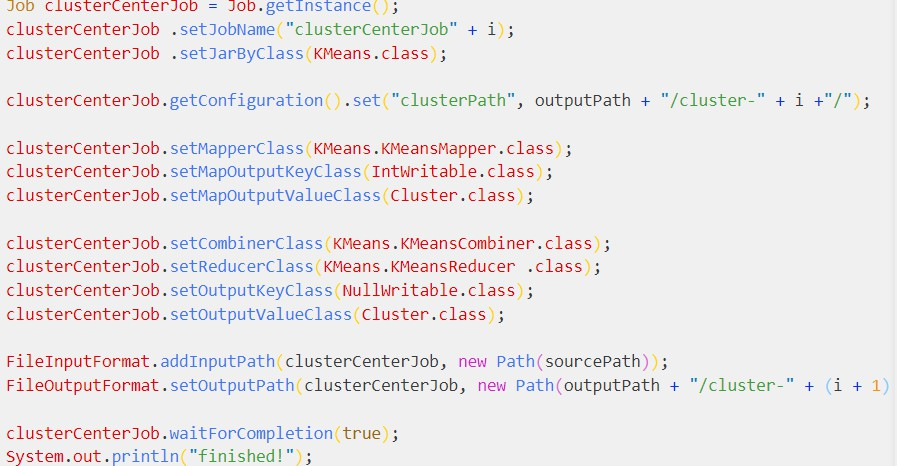
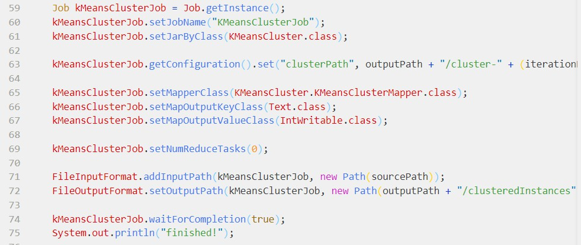
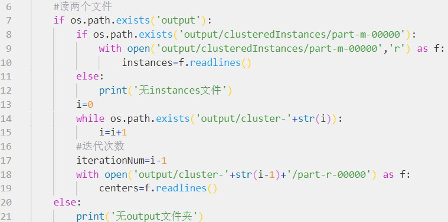
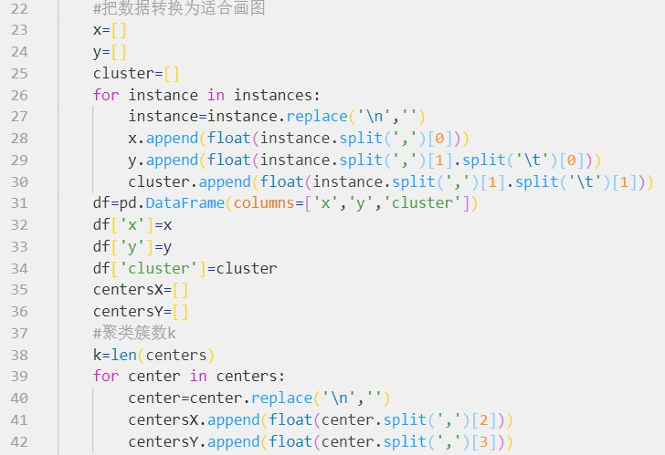
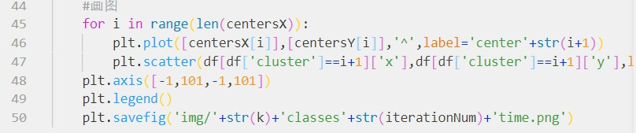

# hw7

## 文件结构

除了与之前作业相同的部分外，img文件夹保存了聚类的可视化结果，mdImg保存了md文件需要的图片，resultDemo.py是实现可视化的python源文件,output文件夹中保存的是k和迭代次数均为3时的输出文件（其他情况的输出未保存part-r-00000等文件，而直接转换为可视化图片保存在img中了）。

## 作业要求

在MapReduce上实现K-Means算法并在小数据集上测试。可以使用附件的数据集，也可以随机生成若干散点的二维数据（x, y)。设置不同的K值和迭代次数，可视化聚类结果。

提交要求同作业5，附上可视化截图。

## 设计思路

由于代码是既成的，我们不需要改，只需要看懂并分情况测试。在看伊始，我不解于此项目java文件之多。与段添濠同学讨论的过程中，他提醒我，虽然文件多，但是这个项目的架构非常清晰，把一个并不庞大的聚类项目分解得恰到好处，代码也很工整利落。后来我自己再看，诚如此。

代码的总体思路并不复杂。main函数在KMeansDriver.java文件中，分两个阶段。第一阶段主要是KMeans.java，即执行Kmeans聚类算法，并在每迭代一次时，都输出得到的各簇中心的坐标。

第二阶段主要是KMeansCluster.java，即按照第一阶段得到的最新一次簇中心，将输入文件中的点归入各簇，并最终输出一个带标识的文件。

而目录中的Instance.java文件涉及每个点，Cluster.java涉及每个簇。

这是总体的思路，其他的实现部分，就跟课上讲的一样。经过实践，这些代码也都是能跑出正确结果的。具体的实践结果见下。

## 实验结果

这次实验中，我们的主要任务除了理解代码，还有进行可视化。

可视化的实现，我使用的是python的matplotlib.pyplot包，在不同k值和迭代次数的hadoop运行结束后，通过读取output文件夹中的输出文件，

处理读到的数据，

生成图像，并`将图像保存到了img文件夹中`，命名方式是`簇数+classes+迭代次数+time.png`。

python源文件是当前目录下的resultDemo.py文件。

从图像上看，项目中的java文件实现的聚类算法是没有问题的。

关于不同k值和迭代次数对于聚类结果的影响，见下思考。

## 思考

实验中k和迭代次数的调整区间如下：k:[2,3,4,5];迭代次数:[3,10,30,40,50,60]。得到以下一些初步结论：

1.迭代次数为3时，面对100个点规模的样本，即使只分两类也尚未收敛。这也很合常理，毕竟迭代3次实在太少了。

2.簇数为2和4时，只要迭代十次即可收敛（可比较迭代十次和三十次时的图像得知）；而簇数为3和5时，迭代50次尚未收敛（可比较迭代50次和60次时的图像得知）。这可能说明簇数为偶数时，收敛速度会较快，簇数为奇数时，收敛速度会较慢。猜测这可能与代码细节有关。

考虑到运行速度的问题，并未进行迭代次数大于60的实验。不过这个初步结论也蛮有趣的。

正如群里有同学提到，单纯的点集聚类，现实意义不太大，进行这样一些捕风捉影的实验已经让人感到些许满足。